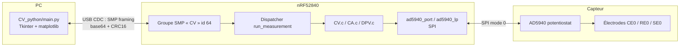

# ParisBioTek — Firmware nRF52840 + AD5940 & outil PC de voltampérométrie

Plateforme de **mesure électrochimique** sur nRF52840 (Nordic) piloté depuis un PC :
un microcontrôleur exécute les techniques (voltampérométrie cyclique, chronoampérométrie,
DPV) sur un potentiostat **AD5940**, et un outil Python les déclenche / récupère / trace
via USB — **sur le même canal que la mise à jour du firmware (DFU)**.

> Ce dépôt couvre le **firmware** et l'**outil PC**. L'application Android compagnon
> (authentification NFC + BLE) n'est pas nécessaire pour développer ici.

---

## 1. Aperçu



- Un **seul port USB (CDC ACM)** sert à la fois au **DFU mcumgr** et au **pilotage des
  mesures** (groupe SMP custom `id 64`). Un seul programme peut ouvrir le port à la fois.
- Les **logs / console** sortent sur **RTT (J-Link)**, jamais sur l'USB (sinon les trames
  SMP seraient corrompues).

---

## 2. Arborescence

```
firmware/                     ← ce dossier (projet NCS/Zephyr, sysbuild + MCUboot)
├── CMakeLists.txt
├── prj.conf                  ← config Bluetooth/NFC/USB/mcumgr + RTT
├── app.overlay               ← 1 CDC ACM (console+DFU+CV), SPI1 AD5940, GPIO
├── flash.ps1                 ← flash USB DFU en 1 commande (upload→test→reset)
├── mcumgr-client.exe         ← client DFU série (0.0.9)
└── src/
    ├── main.c                ← USB/BLE/NFC + groupe SMP CV + dispatcher
    ├── methods.h             ← enum des techniques (CV=0, CA=1, DPV=2)
    ├── CV.c / CV.h           ← voltampérométrie cyclique (séquenceur AD5940)
    ├── CA.c / CA.h           ← chronoampérométrie (logiciel-timé)
    ├── DPV.c / DPV.h         ← voltamp. à impulsions différentielles (logiciel-timé)
    ├── ad5940_lp.c/.h        ← primitives boucle basse-puissance (LPDAC+LPTIA) + RTIA
    ├── RampTest.c/.h         ← moteur « ramp » ADI (utilisé par la CV)
    ├── ad5940.c/.h           ← pilote ADI AD5940
    └── ad5940_port.c/.h      ← portage SPI Zephyr + alimentation capteur

CV_python/                    ← outil PC (dossier voisin)
└── main.py                   ← GUI de pilotage / tracé / export
```

---

## 3. Matériel

| Élément            | Détail                                                              |
|--------------------|--------------------------------------------------------------------|
| Carte              | **nRF52840 DK** (`nrf52840dk/nrf52840`)                             |
| Capteur            | **AD5940** (potentiostat) sur **SPI1**, mode 0                      |
| Programmation      | **J-Link** (VCOM/RTT) *ou* **USB DFU** (mcumgr sur le CDC natif)    |
| Électrodes         | CE0 (contre-électrode), RE0 (référence), SE0 (travail)             |

Câblage SPI (voir `app.overlay`) : `SCLK=P0.13  MOSI=P0.22  MISO=P0.15  CS=P0.17`,
reset `P0.20`, alim capteur `P1.00`.

**Test « résistance »** (bring-up sans cellule réelle) : placer une résistance étalon
entre **CE0** et le nœud **(RE0 relié à SE0)**. Une CV doit alors donner une droite dont la
pente = la résistance. Le RTIA est calibré via une **RCAL externe** (`CV_RCAL_OHM` dans
`src/CV.h`) — ajuster cette valeur à la RCAL réellement câblée pour la précision.

---

## 4. Prérequis logiciels

### Firmware — nRF Connect SDK **v3.3.0**
Installer via le **Toolchain Manager** de Nordic (ou l'extension *nRF Connect for VS Code*) :
- SDK : `C:\ncs\v3.3.0`
- Toolchain : `C:\ncs\toolchains\936afb6332`

`west` / `nrfutil` ne sont pas sur le PATH global : ouvrir un shell SDK avec
```powershell
nrfutil toolchain-manager launch --shell
```
ou simplement **ouvrir le dossier `firmware/` dans VS Code + nRF Connect** (build/flash en clic).

### Outil PC — Python 3.9+
```bash
pip install pyserial cbor2 matplotlib
```
(`tkinter` est fourni avec Python sous Windows.)

---

## 5. Compiler & flasher le firmware

> À faire dans un shell SDK (voir §4), depuis `firmware/`.

### Build
```powershell
west build -d build_2 -b nrf52840dk/nrf52840    # 1re fois
west build -d build_2                            # builds suivants (incrémental)
```

### Flash — option A : J-Link (recommandé en dev)
```powershell
west flash -d build_2
```
Console + logs sur **RTT** : `JLinkRTTViewer` (ou l'onglet RTT de nRF Connect).

### Flash — option B : USB DFU (sans sonde)
Le port USB CDC natif expose le **serial recovery mcumgr**. `upload` écrit toujours dans le
slot secondaire : il faut ensuite `test` + `reset` pour booter l'image. Le script automatise tout :
```powershell
.\flash.ps1 -Port COM18       # adapter au COM du CDC natif
```
> ⚠️ Fermer l'outil Python (§6) avant un DFU : **un seul propriétaire du port** à la fois.
> Après reset, MCUboot attend ~30 s (fenêtre DFU) avant de lancer l'application.

### Points de configuration à connaître (`prj.conf`)
- `CONFIG_UART_CONSOLE=n`, `CONFIG_LOG_BACKEND_UART=n` → **canal SMP propre** (logs sur RTT).
- `CONFIG_MCUMGR_TRANSPORT_UART=y` → DFU + groupe CV sur le CDC.
- `CONFIG_UDC_BUF_POOL_SIZE=16384`, `CONFIG_UDC_BUF_COUNT=32` → buffers USB (sinon
  « udc: Failed to allocate net_buf »).

---

## 6. Utiliser l'outil PC (`CV_python`)

```bash
cd CV_python
python main.py
```

Flux dans l'interface :
1. **Détecter** — sonde chaque port COM avec une requête SMP `STATUS` et retient celui qui
   répond (= le port DFU/mcumgr, le même que `flash.ps1`).
2. **Connecter**.
3. Choisir la **méthode** (voir §7), régler les paramètres et la **gamme RTIA**.
4. **▶ Lancer** — la mesure s'exécute sur la carte, les points sont téléchargés et tracés.

### Session / test & export
Renseigne un **nom de session** et un **nom de test** (+ **notes** libres avant la mesure).
À chaque mesure enregistrée :
```
CV_python/mesures/<session>/<test>/<test>_<AAAAMMJJ_HHMMSS>.csv
CV_python/mesures/<session>/<test>/<test>_<AAAAMMJJ_HHMMSS>.txt   ← méthode, params, résultat, notes
```
Colonne X du CSV : `voltage_mV` (CV/DPV) ou `time_ms` (CA).

---

## 7. Techniques disponibles

| Méthode | id | Axe X | Paramètres principaux |
|---------|----|-------|-----------------------|
| **Voltampérométrie cyclique (CV)** | 0 | Tension (mV) | départ, sommet, Vzero, nb de pas, vitesse (mV/s), délai échantillon |
| **Chronoampérométrie (i–t)**       | 1 | Temps (s)    | potentiel, Vzero, durée, intervalle |
| **DPV (impulsions différentielles)** | 2 | Tension (mV) | départ, fin, hauteur de marche, amplitude d'impulsion, durée d'impulsion, période |

- **RTIA** réglable (table 200 Ω → 512 kΩ) : fixe la fenêtre de courant `I_max ≈ 0,9 V / RTIA`.
  L'**auto-range** n'existe **que pour la CV** ; en CA/DPV, choisir une gamme fixe.
- CV = moteur séquenceur ADI (`RampTest.c`). CA & DPV = **logiciel-timés** (pilotage direct du
  LPDAC + lectures ADC ponctuelles via `ad5940_lp.c`), échelle de courant calibrée comme la CV.

---

## 8. Protocole SMP (pour développer côté firmware/PC)

Groupe custom **`id 64`** (`MGMT_GROUP_ID_PERUSER`), transport = SMP sur série (le même que le DFU).

| Cmd | Op | Payload entrée | Réponse |
|-----|----|----------------|---------|
| `START` (0)  | write | `method` + params entiers optionnels (voir ci-dessous) | `{rc:0}` |
| `STATUS` (1) | read  | `{}` | `{run, n, peak_na, r_ohm, rtia, method}` |
| `DATA` (2)   | read  | `{off}` | `{off, n, v:[…], i:[…]}` (lots de 64) |

Clés `START` (toutes optionnelles, entiers) :
- **commun** : `method` (0/1/2), `vzero_mv`, `rtia` (CV : `0`=auto-range ; CA/DPV : `≤0`→4000)
- **CV** : `start_mv peak_mv steps dur_ms delay_us`
- **CA** : `ca_pot_mv ca_dur_ms ca_interval_ms`
- **DPV** : `start_mv end_mv dpv_estep_mv dpv_epulse_mv dpv_tpulse_ms dpv_tperiod_ms`

`v[]` = tension mV (CV/DPV) **ou** temps ms (CA) ; `i[]` = courant nA (ΔI en DPV).

Framing (implémenté dans `main.py`, identique à `serial_util.c` de Zephyr) : marqueur
`0x0609` (1er fragment) / `0x0414` (suivant), base64 de `[len BE 2o][paquet][CRC16 BE 2o]`,
terminé par `\n` ; CRC16-ITU-T/XMODEM (poly `0x1021`, init `0`) ; en-tête SMP `op,flags,len,group,seq,id`.

---

## 9. Étendre

- **Nouvelle technique** : créer `XXX.c/.h` sur le modèle de `CA.c` (utilise `ad5940_lp`),
  ajouter une valeur à `methods.h`, un `case` dans `run_measurement()` (`main.c`), décoder ses
  clés dans `cv_mgmt_start`, l'ajouter à `CMakeLists.txt`, puis un panneau de paramètres dans
  `main.py` (`_build_*_params` + `_read_params`).
- **Précision courant** : ajuster `CV_RCAL_OHM` (`src/CV.h`) à la RCAL réelle.

---

## 10. Dépannage

| Symptôme | Cause / solution |
|----------|------------------|
| Python « Aucune carte détectée » | Mauvais port, ou port tenu par un autre logiciel (mcumgr, terminal série, GUI en double). Fermer les autres, réessayer. |
| Accès au port refusé / freeze | Le port DFU est déjà ouvert ailleurs — un seul propriétaire à la fois. |
| DFU « ne reconnaît pas la commande » | Fermer le GUI Python avant `flash.ps1` ; vérifier le bon COM (CDC natif, pas la VCOM J-Link). |
| Mesure = 0 point / pic 0 | AD5940 muet (ADIID ≠ 0x4144) : vérifier SPI/alim ; ou câblage électrodes. Voir RTT. |
| Rien sur la console série | Normal : logs sur **RTT** (`CONFIG_UART_CONSOLE=n`). |
| `west`/`nrfutil` introuvable | Ouvrir un shell SDK (`nrfutil toolchain-manager launch --shell`) ou VS Code + nRF Connect. |
| SWD/flash refusé (APPROTECT) | `nrfutil device recover --serial-number <sn>` puis `west flash`. |

---

## 11. Notes / limites

- CA & DPV sont **logiciel-timés** (précision d'impulsion ≥ ~10–50 ms) — une version
  séquenceur (plus rapide/précise) reste à faire.
- L'**auto-range** est réservé à la CV.
- Le NFC/BLE (app Android) reste fonctionnel mais hors périmètre de ce README.
